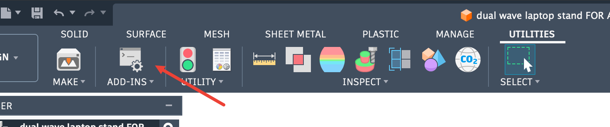
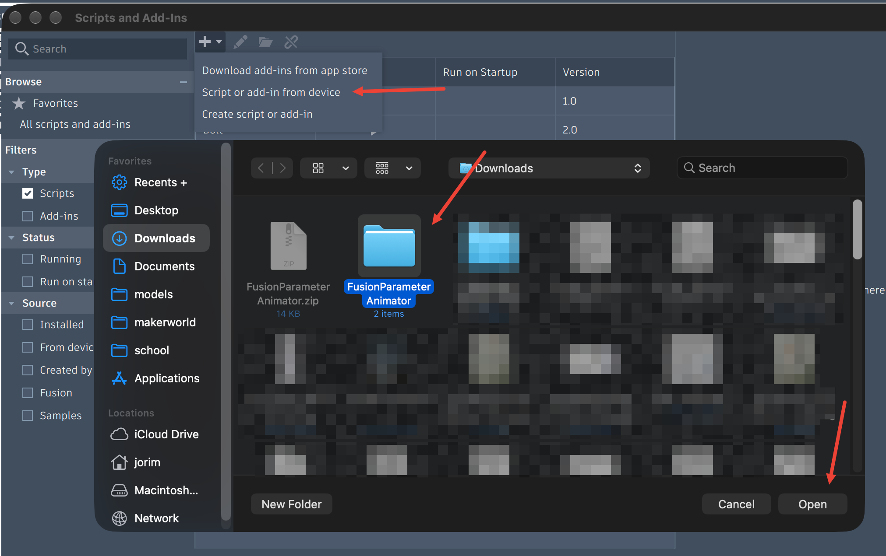
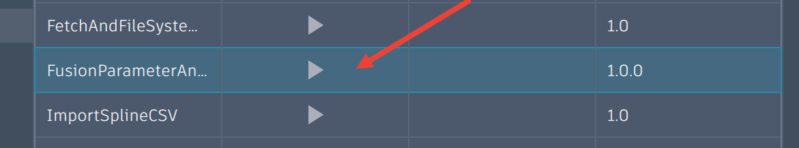
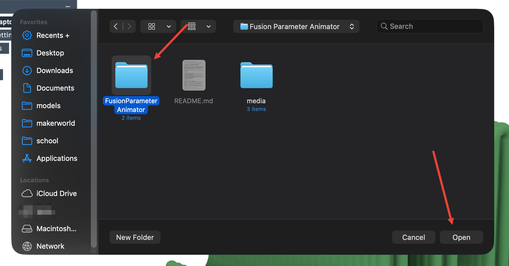
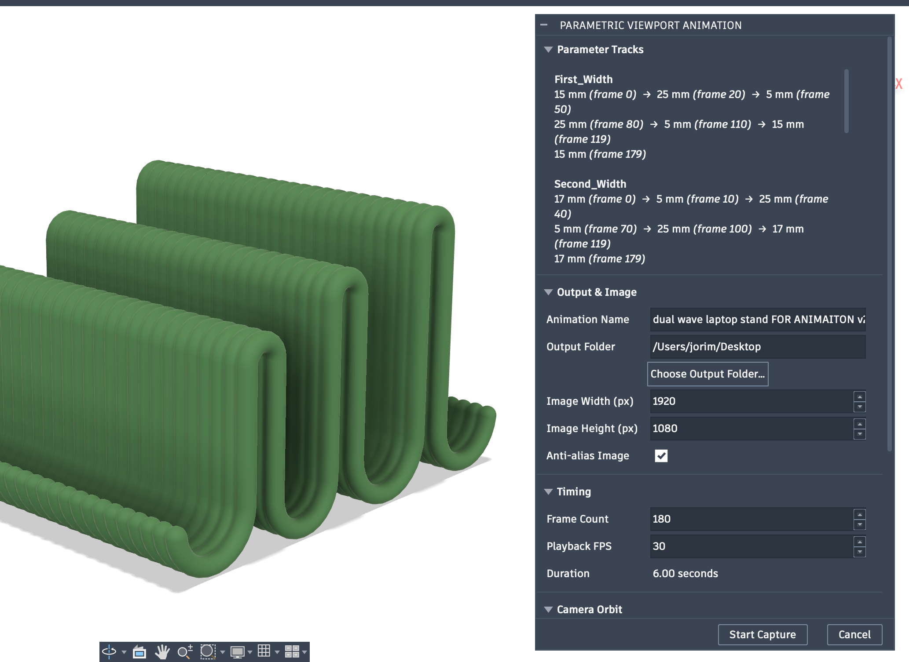
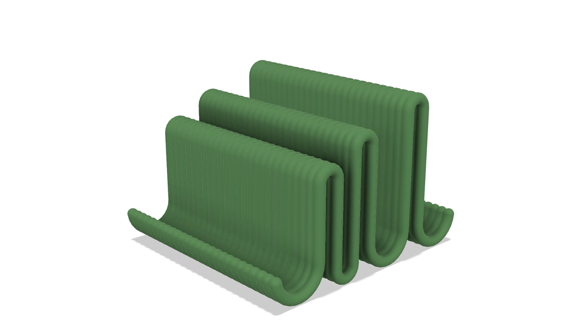
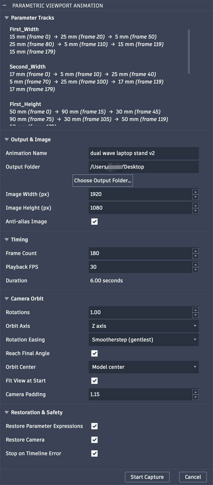

# Parametric Animator for Autodesk Fusion

A script to make an animation from a Fusion design while:

- changing one or more numeric **User Parameters**;
- rotating the viewport camera around the model
- capturing an ordered PNG for every frame.

The PNG sequence can then be turned into an MP4, MOV, GIF, or another video format with FFmpeg. The script uses Fusion's current viewport appearance, so the captured frames include the visual style, materials, environment, visibility, and camera view you have set in Fusion.


## Contents

- [Installation](#installation)
- [Configuring parameter tracks / keyframes](#configuring-parameter-tracks--keyframes)
- [Complete settings reference](#complete-settings-reference)
- [Output files](#output-files)
- [Creating a video with FFmpeg](#creating-a-video-with-ffmpeg)
- [Useful animation settings](#useful-animation-settings)
- [Troubleshooting](#troubleshooting)
- [Limitations](#limitations)
- [Acknowledgements](#acknowledgements)
- [References](#references)

## Installation

1. Download and extract the package from the releases tab.
2. [Configure the parameter keyframes according to your model.](#configuring-parameter-tracks--keyframes)
3. Open the **Scripts and Add-Ins** menu under Utilities.



4. Choose **Script or add-in from device**, and select the `FusionParameterAnimator` file you extracted.



5. Select **FusionParameterAnimator** in the Scripts list and click the triangle to run it.



6. You'll be prompted to select the script folder again, select the `FusionParameterAnimator` file you extracted.



7. You should see a dialog menu in Fusion. For more info on what each setting does, check out [Complete settings reference](#complete-settings-reference).



## Configuring parameter tracks / keyframes

Tracks are the only animation settings edited in the Python file. Everything else is available in the Fusion settings dialog.

#### I'll be honest, this can be really troublesome to setup. I would just paste these instructions into an LLM, give it min and max parameter dimensions, and ask it to make the settings for you. Especially if you want smooth animations, such as [my example](#example-setup) below.

Find the `"tracks"` list near the top of `FusionParameterAnimator.py`. These are the default keyframes in the file:

```python
 "tracks": [
        {
            "name": "width",
            "keyframes": [
                {"frame": 0, "value": "50 mm", "ease": "smoothstep"},
                {"frame": 59, "value": "100 mm", "ease": "smoothstep"},
                {"frame": 119, "value": "50 mm", "ease": "hold"},
                {"frame": 179, "value": "50 mm"},
            ],
        },
        {
            "name": "thickness",
            "keyframes": [
                {"frame": 0, "value": "3 mm", "ease": "hold"},
                {"frame": 59, "value": "3 mm", "ease": "smoothstep"},
                {"frame": 89, "value": "10 mm", "ease": "smoothstep"},
                {"frame": 119, "value": "3 mm", "ease": "hold"},
                {"frame": 179, "value": "3 mm"},
            ],
        },
    ],
```

This example animates the User Parameter `width` from 50 mm to 100 mm, then back to 50 mm.
At the same time, the parameter `thickness` animates from 3 mm to 10 mm, then back to 3 mm.
With a frame count of 180, the animation runs from frame `0` through frame `179`.

### Anatomy of a track

Each track contains:

| Field       | Meaning                                                                                                                                                                                     |
| ----------- | ------------------------------------------------------------------------------------------------------------------------------------------------------------------------------------------- |
| `name`      | The exact, case-sensitive name of a numeric **User Parameter** in the active Fusion design. Model parameters and text parameters are not supported.                                         |
| `keyframes` | An ordered list of frames at which that parameter has a specified value. Keyframes are sorted by frame number when capture starts.                                                          |
| `frame`     | A zero-based whole-number frame index. It must be unique within the track and lower than **Frame Count**.                                                                                   |
| `value`     | A Fusion-compatible value written as a string. Include units where applicable, such as `"25 mm"`, `"1.5 in"`, or `"45 deg"`. A unitless parameter can use a value such as `"2"`.            |
| `ease`      | Optional interpolation from this keyframe **to the next keyframe**. If omitted, it defaults to `smoothstep`. The final keyframe's easing has no effect because it has no following segment. |

Before the first keyframe, the first value is held. After the final keyframe, the final value is held. A track can therefore begin later or finish earlier than the complete animation.

### Parameter easing modes

| Easing value          | Result                                                                                                                                                |
| --------------------- | ----------------------------------------------------------------------------------------------------------------------------------------------------- |
| `"linear"`            | Changes at a constant rate. Useful for mechanical motion or a deliberately uniform sweep.                                                             |
| `"smoothstep"`        | Gently accelerates and decelerates across the segment. This is the default and works well for most dimension changes.                                 |
| `"smootherstep"`      | Starts and ends more gently than `smoothstep`. Useful for polished, soft motion.                                                                      |
| `"ease_in_out_cubic"` | Stronger acceleration and deceleration, with more of the change concentrated near the middle.                                                         |
| `"hold"`              | Keeps the current value until the next keyframe, then changes immediately. Use this for an intentional step or snap rather than a gradual transition. |

Remember that easing belongs to the keyframe at the **start** of a segment:

```python
{"frame": 20, "value": "40 mm", "ease": "linear"},
{"frame": 80, "value": "100 mm"},
```

Here, `linear` controls frames 20–80.

### Creating a pause

Repeat a value at two different frames. The value remains unchanged between them:

```python
{"frame": 0, "value": "50 mm", "ease": "smootherstep"},
{"frame": 30, "value": "50 mm", "ease": "smootherstep"},
{"frame": 90, "value": "100 mm"},
```

This holds 50 mm through frame 30, then smoothly moves toward 100 mm. Use `hold` only when you want a sudden jump at the next keyframe.

### Making the parameter animation loop

Give each track the same value at its first and last keyframes:

```python
{"frame": 0, "value": "50 mm", "ease": "smootherstep"},
{"frame": 59, "value": "100 mm", "ease": "smootherstep"},
{"frame": 119, "value": "50 mm"},
```

This returns the model to its starting dimensions. If the camera should also loop continuously, use the perpetual-spin settings described in [Useful animation settings](#useful-animation-settings).

### Track rules and validation

- Parameter names are case-sensitive and must refer to numeric **User Parameters**.
- Each track name must be unique.
- Each track needs at least one keyframe.
- Keyframe numbers must be unique, non-negative whole numbers.
- The highest keyframe must be lower than **Frame Count**. The dialog automatically prevents a frame count that is too short.
- Use values and units accepted by Fusion's Parameters dialog.
- Test both the keyframe values and intermediate values. Two valid endpoints can still pass through an invalid model state.

## Example setup

This is an animation of my [Parametric Wave Device Stand](https://makerworld.com/en/models/3057744). I tried to get the heights to smoothly animate, almost wave-like.



<details>
<summary><h3>Code</h3></summary>

```python
   "tracks": [
        {
    "name": "First_Width",
    "keyframes": [
        {"frame": 0,   "value": "15 mm", "ease": "smoothstep"},
        {"frame": 20,  "value": "25 mm", "ease": "smoothstep"},
        {"frame": 50,  "value": "5 mm",  "ease": "smoothstep"},
        {"frame": 80,  "value": "25 mm", "ease": "smoothstep"},
        {"frame": 110, "value": "5 mm",  "ease": "smoothstep"},
        {"frame": 119, "value": "15 mm", "ease": "hold"},
        {"frame": 179, "value": "15 mm"},
    ],
},
{
    "name": "Second_Width",
    "keyframes": [
        {"frame": 0,   "value": "17 mm", "ease": "smoothstep"},
        {"frame": 10,  "value": "5 mm",  "ease": "smoothstep"},
        {"frame": 40,  "value": "25 mm", "ease": "smoothstep"},
        {"frame": 70,  "value": "5 mm",  "ease": "smoothstep"},
        {"frame": 100, "value": "25 mm", "ease": "smoothstep"},
        {"frame": 119, "value": "17 mm", "ease": "hold"},
        {"frame": 179, "value": "17 mm"},
    ],
},
{
    "name": "First_Height",
    "keyframes": [
        {"frame": 0,   "value": "50 mm", "ease": "smoothstep"},
        {"frame": 15,  "value": "90 mm", "ease": "smoothstep"},
        {"frame": 45,  "value": "30 mm", "ease": "smoothstep"},
        {"frame": 75,  "value": "90 mm", "ease": "smoothstep"},
        {"frame": 105, "value": "30 mm", "ease": "smoothstep"},
        {"frame": 119, "value": "50 mm", "ease": "hold"},
        {"frame": 179, "value": "50 mm"},
    ],
},
{
    "name": "Second_Height",
    "keyframes": [
        {"frame": 0,   "value": "60 mm", "ease": "smoothstep"},
        {"frame": 5,   "value": "30 mm", "ease": "smoothstep"},
        {"frame": 30,  "value": "90 mm", "ease": "smoothstep"},
        {"frame": 60,  "value": "30 mm", "ease": "smoothstep"},
        {"frame": 90,  "value": "90 mm", "ease": "smoothstep"},
        {"frame": 119, "value": "60 mm", "ease": "hold"},
        {"frame": 179, "value": "60 mm"},
    ],
},
{
    "name": "Third_Height",
    "keyframes": [
        {"frame": 0,   "value": "70 mm", "ease": "smoothstep"},
        {"frame": 15,  "value": "30 mm", "ease": "smoothstep"},
        {"frame": 45,  "value": "90 mm", "ease": "smoothstep"},
        {"frame": 75,  "value": "30 mm", "ease": "smoothstep"},
        {"frame": 105, "value": "90 mm", "ease": "smoothstep"},
        {"frame": 119, "value": "70 mm", "ease": "hold"},
        {"frame": 179, "value": "70 mm"},
    ],
},
    ],
```

</details>

## Complete settings reference

Every group and setting also has a short explanation when hovered over in Fusion.



<details>
<summary><h3>Parameter Tracks</h3></summary>

| Item                          | What it does                                                                                                                                                 |
| ----------------------------- | ------------------------------------------------------------------------------------------------------------------------------------------------------------ |
| **Parameter Tracks overview** | Read-only summary of the tracks defined in the Python file. Each keyframe is shown as `value (frame number)`. Edit the `CONFIG["tracks"]` list to change it. |

</details>
<details>
<summary><h3>Output & Image</h3></summary>

| Setting                   | What it does                                                                                                                                                        |
| ------------------------- | ------------------------------------------------------------------------------------------------------------------------------------------------------------------- |
| **Animation Name**        | Names the timestamped output folder and the MP4 filename suggested at the end of capture. Characters that are unsafe in filenames are replaced.                     |
| **Output Folder**         | Parent directory in which a new timestamped animation folder is created. The folder must already exist and be writable. Existing frame folders are not overwritten. |
| **Choose Output Folder…** | Opens Fusion's folder picker and fills in **Output Folder**.                                                                                                        |
| **Image Width (px)**      | Width of every captured PNG. Higher resolutions require more capture time, storage, and FFmpeg processing.                                                          |
| **Image Height (px)**     | Height of every captured PNG. Choose a suitable aspect ratio, such as 1920×1080 for 16:9 video or 1080×1080 for square video.                                       |
| **Anti-alias Image**      | Smooths jagged viewport edges in the captured PNGs. Disable it for faster low-resolution test captures.                                                             |

</details>
<details>
<summary><h3>Timing</h3></summary>

| Setting          | What it does                                                                                                                                                                            |
| ---------------- | --------------------------------------------------------------------------------------------------------------------------------------------------------------------------------------- |
| **Frame Count**  | Total number of PNGs to generate. More frames create smoother motion but take longer. It cannot be lower than the final configured keyframe plus one.                                   |
| **Playback FPS** | Intended video playback speed. It changes the duration calculation and suggested FFmpeg command, but it does not change how many PNGs are captured or how quickly Fusion captures them. |
| **Duration**     | Read-only estimate calculated as **Frame Count ÷ Playback FPS**. For example, 180 frames at 30 fps is 6 seconds.                                                                        |

</details>
<details>
<summary><h3>Camera Orbit</h3></summary>

| Setting               | What it does                                                                                                                                                                                                                                                                        |
| --------------------- | ----------------------------------------------------------------------------------------------------------------------------------------------------------------------------------------------------------------------------------------------------------------------------------- |
| **Rotations**         | Number of camera turns across the animation. `0` disables camera rotation, `0.25` is 90°, `0.5` is 180°, `1` is one complete 360° turn, and `2` is two turns. Negative values rotate in the opposite direction.                                                                     |
| **Orbit Axis**        | Axis around which the camera rotates. Choose positive or negative X, Y, or Z. Z is normally appropriate when the model's up direction is Z. A negative axis reverses the direction.                                                                                                 |
| **Rotation Easing**   | Controls the camera's angular speed. `Smootherstep` gives the gentlest start and stop, `Smoothstep` is slightly firmer, `Ease in/out cubic` emphasizes acceleration and deceleration, and `Linear` maintains constant angular speed. This is independent of parameter-track easing. |
| **Reach Final Angle** | When enabled, the final PNG reaches the exact requested angle—for example, exactly 360° for one rotation. This is best for an eased orbit that should stop. Disable it with **Linear** easing for a seamless repeating spin, so the duplicate 360° endpoint is omitted.             |
| **Orbit Center**      | `Model Center` uses the root component's bounding-box center at frame 0. `Current Camera Target` preserves the pivot already set in the viewport. The chosen target remains fixed during capture.                                                                                   |
| **Fit View at Start** | Fits the frame-0 model into view once before capture. It deliberately does not refit after dimensions change. Disable it when you have manually framed the largest model state.                                                                                                     |
| **Camera Padding**    | Multiplies the fitted or current camera framing to add space around the model. `1.00` adds no extra space; `1.15` adds approximately 15%. Increase it if later parameter states grow beyond the frame.                                                                              |

</details>
<details>
<summary><h3>Restoration & Safety</h3></summary>

| Setting                           | What it does                                                                                                                                                                                                                                                                         |
| --------------------------------- | ------------------------------------------------------------------------------------------------------------------------------------------------------------------------------------------------------------------------------------------------------------------------------------ |
| **Restore Parameter Expressions** | After a successful capture, restores the exact original expressions of all animated User Parameters. If capture fails or is cancelled, restoration is attempted regardless of this setting. Disable it only when you intentionally want the model left at its final animated values. |
| **Restore Camera**                | After a successful capture, returns the viewport to its original camera. If capture fails or is cancelled, restoration is attempted regardless of this setting. Disable it to leave the viewport at the final animation angle.                                                       |
| **Stop on Timeline Error**        | Stops when a timeline feature reports an error, preserving the partial output rather than continuing with a visibly broken model. A failed **Compute All** still stops capture even when this option is disabled.                                                                    |

</details>
<details>
<summary><h3>Remembered settings</h3></summary>

After a successful submission, menu values are saved in `FusionParameterAnimator.settings.json` beside the script and loaded next time. The animation name is reused only when the same Fusion document is active; the other menu values are shared. Delete this generated JSON file to return to the defaults near the top of the Python file. Deleting it does not affect the parameter tracks.

</details>
<details>

## Output files

Each run creates a folder named similar to:

```text
ParametricAnimation_MyDesign_20260829_154500
```

It contains:

| File                                    | Contents                                                                                                                                                         |
| --------------------------------------- | ---------------------------------------------------------------------------------------------------------------------------------------------------------------- |
| `frame_00000.png`, `frame_00001.png`, … | Ordered viewport images used to create the video. Numbering contains at least five digits.                                                                       |
| `frames.csv`                            | Frame number, camera angle in degrees, and numeric parameter values for every completed frame. Lengths use Fusion's internal centimeters and angles use radians. |
| `animation_settings.json`               | The complete settings used for the run and the original parameter expressions. Useful for reproducing or diagnosing a capture.                                   |

The script does not encode a video itself. When capture completes, Fusion displays the output path and a ready-to-run FFmpeg command. Cancelled or failed runs keep the frames that were already captured.

## Creating a video with FFmpeg

### MP4 (Smaller Size)

Open a terminal in the image output folder and run:

```sh
ffmpeg -framerate 30 -i "frame_%05d.png" -c:v libx264 -crf 18 -pix_fmt yuv420p -movflags +faststart "parametric-animation.mp4"
```

Replace `30` with the **Playback FPS** used in Fusion. Important options:

- `-framerate 30` tells FFmpeg how quickly to read the PNG sequence;
- `-crf 18` sets high visual quality—larger numbers make smaller, lower-quality files;
- `-pix_fmt yuv420p` improves playback compatibility; and
- `-movflags +faststart` makes web playback begin sooner.

### MOV (Very large size)

For a larger ProRes file:

```sh
ffmpeg -framerate 30 -i "frame_%05d.png" -c:v prores_ks -profile:v 3 -pix_fmt yuv422p10le "parametric-animation.mov"
```

### GIF

For a smaller 15 fps, 960-pixel-wide preview GIF:

```sh
ffmpeg -framerate 30 -i "frame_%05d.png" -vf "fps=15,scale=960:-1:flags=lanczos,split[s0][s1];[s0]palettegen[p];[s1][p]paletteuse" "parametric-animation.gif"
```

Change `960` to the desired width. GIF files have limited color and can become very large; MP4 is preferable for the full-quality animation.## Useful animation settings

### Parameter animation without camera movement

Set **Rotations** to `0`. The user parameters will animate while the camera remains at its starting position. Camera easing and **Reach Final Angle** have no visible effect in this mode.

### Spin-only animation without dimensional changes

The current script requires at least one valid track. Give any numeric User Parameter a single keyframe at its existing value:

```python
"tracks": [
    {
        "name": "width",
        "keyframes": [
            {"frame": 0, "value": "50 mm"},
        ],
    },
],
```

The parameter remains constant for every frame, so the result is a normal turntable animation. Set **Rotations** to the desired number of turns.

## Useful animation settings

### Seamless perpetual spin

Use:

- **Rotations:** `1` or another whole number;
- **Rotation Easing:** `Linear`; and
- **Reach Final Angle:** disabled.

This omits the duplicate final 360° pose so the next loop continues at constant speed. To make the changing model seamless too, every track must return to its starting value by its final keyframe.

### Eased presentation spin

For a camera that starts from rest, smoothly accelerates, and stops at the final pose, use:

- **Rotation Easing:** `Smootherstep`; and
- **Reach Final Angle:** enabled.

This is ideal for a video that plays once. It is not intended to loop at constant speed.

### Reverse or partial orbit

- Set **Rotations** to `-1` for a full turn in the opposite direction.
- Set it to `0.5` for a 180° reveal.
- Set it to `-0.25` for a reverse 90° move.

Changing to a negative orbit axis also reverses the direction. Avoid making both the axis and **Rotations** negative unless you intentionally want the two reversals to cancel each other.

### Keep a growing model inside the image

**Fit View at Start** only considers the frame-0 geometry. If the model becomes much larger later, either:

- place its largest state at frame 0 before it shrinks and grows;
- increase **Camera Padding**; or
- disable **Fit View at Start** and manually frame the largest expected state before running the script.

### Stagger several dimensions

Use different keyframe positions on each track. One parameter can animate during frames 0–60, another during 30–90, and a third during 60–119. Repeating a value across two keyframes creates a deliberate pause before that track begins moving.## Troubleshooting

## Troubleshooting

### “User Parameter was not found”

Check spelling and capitalization in the track's `name`. The parameter must appear under **User Parameters**, not only as a generated Model Parameter.

### Invalid keyframe value or unit

Enter the same value in Fusion's Parameters dialog. Use a unit compatible with that parameter, and keep it inside the parameter's valid design range.

### Capture stops on a timeline error

Test intermediate values, not only keyframes. A sweep can cross a geometry or topology failure even when both endpoints work. Narrow the range, change the easing/keyframe timing, or repair the feature that fails.

### The model is cropped

Increase **Camera Padding**, arrange for frame 0 to contain the largest model state, or disable **Fit View at Start** and manually frame the largest state.

### The video duration or speed is wrong

The FFmpeg `-framerate` value must match **Playback FPS**. Changing Playback FPS does not add or remove captured frames; it only changes how quickly those frames play.

### Capture is too slow

Test with fewer frames, smaller image dimensions, and anti-aliasing disabled. Re-enable the desired quality settings after parameter ranges and camera framing are confirmed.

### Old menu values keep returning

Close the dialog, delete `FusionParameterAnimator.settings.json` beside the script, and run it again. This resets menu preferences but leaves the Python track definitions untouched.

## Limitations

- Only numeric User Parameters can be animated.
- Parameter interpolation is numeric. It does not preserve a changing expression during the animation, although the original expression can be restored afterward.
- Camera fitting happens only once; the script intentionally avoids per-frame fitting and its resulting zoom pumping.
- A successful parameter sweep can still be slow on complex designs because Fusion must recompute the complete model for every frame.
- The output matches the active viewport rather than Fusion's photorealistic renderer.
- Do not edit the model, camera, visibility, or visual style while capture is running.

## Acknowledgements

This project was heavily inspired by [Amanda Ghassaei's Fusion360 Scripts](https://github.com/amandaghassaei/Fusion360-Scripts). It provided much of the initial inspiration for exploring how Fusion's API could be used to create animations.

The majority of the code for this project was written with the assistance of OpenAI Codex. I developed the concept, defined the desired functionality and animation behaviour, tested the add-in in Fusion 360, and made manual tweaks, adjustments, and refinements throughout development. Keep in mind that this utility was intended to be a quick side project, so don't expect too much.

## References

- [Autodesk Create Animation API Sample](https://help.autodesk.com/cloudhelp/ENU/Fusion-360-API/files/CreateAnimation_Sample.htm)
- [Autodesk User Parameters API](https://help.autodesk.com/cloudhelp/ENU/Fusion-360-API/files/UserParameters.htm)
- [Autodesk parameter expressions](https://help.autodesk.com/cloudhelp/ENU/Fusion-360-API/files/UserParameter_expression.htm)
- [Autodesk `Design.computeAll`](https://help.autodesk.com/cloudhelp/ENU/Fusion-360-API/files/Design_computeAll.htm)
- [Autodesk viewport camera](https://help.autodesk.com/cloudhelp/ENU/Fusion-360-API/files/Viewport_camera.htm) and [image capture](https://help.autodesk.com/cloudhelp/ENU/Fusion-360-API/files/Viewport_saveAsImageFileWithOptions.htm)
- [FFmpeg download page](https://ffmpeg.org/download.html) and [image-sequence documentation](https://ffmpeg.org/ffmpeg-formats.html#image2-1)
